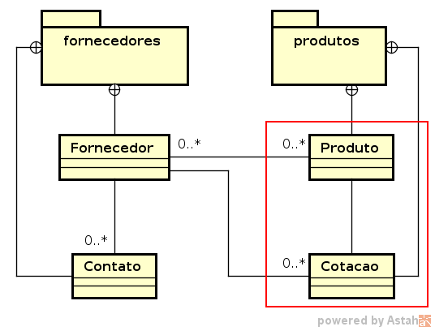

# Desenvolvimento de Serviços em Nuvem com Java

## Assessment

A empresa ACME necessita facilitar e controlar suas compras: de material de limpeza, material de escritório até móveis e utensílios. Todos os itens da empresa (Produto) deverão passar por um sistema que registre as tomadas de preços que são feitas por Internet, telefone, jornais etc (Cotação).

As funcionalidades mais importantes são:

* Cadastrar Produtos.
* Cadastrar Cotações.
* Consultar Cotações por Produto.
* Exportar Cotações.

Todas as outras funcionalidades são apoio para essas 4.

Exportar cotações é simplesmente criar um arquivo CSV com os dados de cotações de um produto escolhido. Esse arquivo CSV deverá ser testado por você, importando-o no Excel, LibreOffice Calc ou similar, a fim de garantir que aparecem corretamente na planilha.